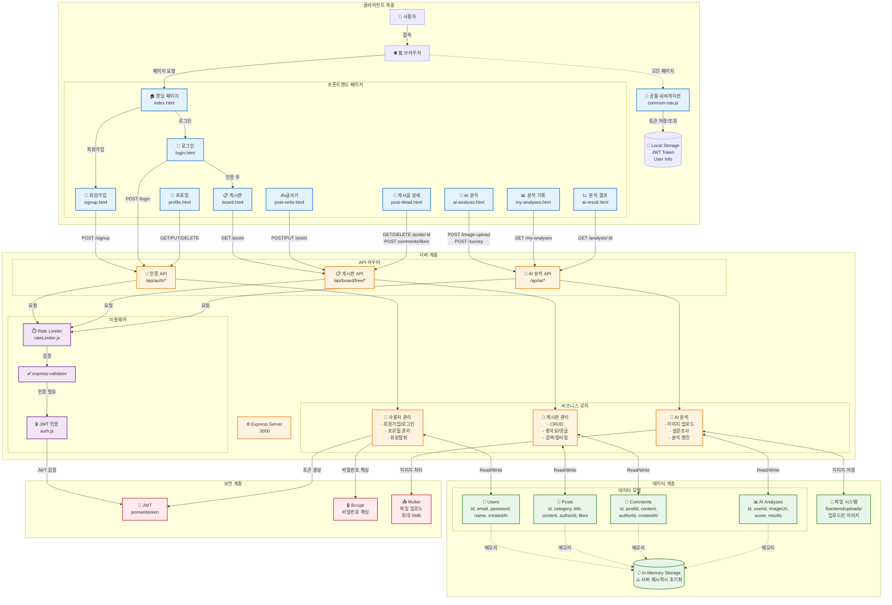
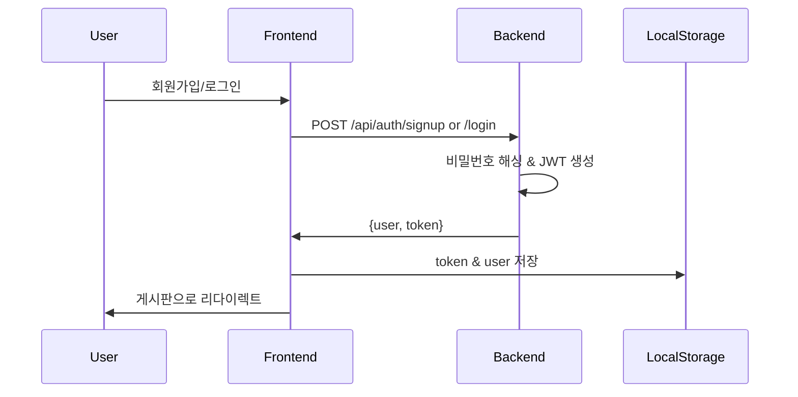
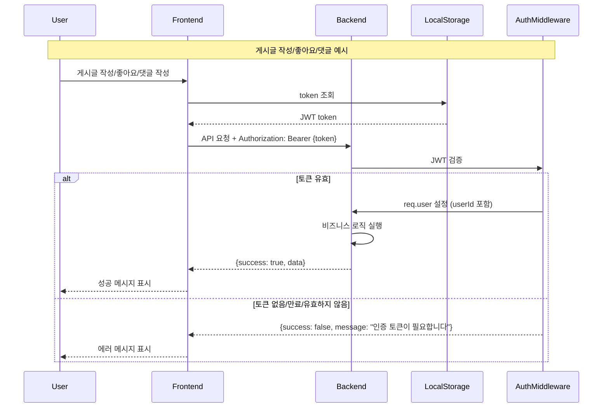

# SkinAI 시스템 아키텍처

## 개요
이 문서는 SkinAI 피부 건강 관리 플랫폼의 전체 시스템 아키텍처를 설명합니다.

## 시스템 아키텍처 다이어그램

## 주요 컴포넌트 설명

### 1. 클라이언트 계층 🎨

#### 프론트엔드 페이지
- **랜딩 페이지** (`index.html`): 서비스 소개 및 Hero 섹션
- **인증 페이지**: 로그인, 회원가입
- **게시판**: 메인 목록, 상세보기, 글쓰기/수정
- **프로필**: 사용자 정보 관리 (4개 탭 시스템)
- **AI 분석**: 피부 분석, 분석 기록, 결과 상세

#### 공통 기능
- **공통 네비게이션** (`common-nav.js`): 모든 페이지 통합 네비게이션
- **Local Storage**: JWT 토큰 및 사용자 정보 저장

### 2. 서버 계층 ⚙️

#### Express 서버 (포트 3000)
Node.js 기반의 백엔드 서버로 모든 API 요청을 처리합니다.

#### 미들웨어
- **JWT 인증** (`auth.js`): 토큰 검증 및 사용자 인증
- **Rate Limiter** (`rateLimiter.js`): API 남용 방지
  - 일반 API: 분당 100회
  - 인증 API: 15분당 5회
  - 게시글 작성: 분당 3회
- **Validator**: `express-validator`를 통한 입력값 검증

#### API 라우터
1. **인증 API** (`/api/auth/*`)
   - 회원가입, 로그인, 로그아웃
   - 프로필 조회/수정, 회원탈퇴
   - 내가 쓴 글/댓글 조회

2. **게시판 API** (`/api/board/free/*`)
   - 게시글 CRUD
   - 좋아요, 댓글 관리
   - 검색 및 카테고리 필터링

3. **AI 분석 API** (`/api/ai/*`)
   - 이미지 업로드
   - 설문조사 제출
   - 분석 결과 조회

### 3. 데이터 계층 💾

#### In-Memory Storage
⚠️ **주의**: 모든 데이터는 메모리에 저장되며, 서버 재시작 시 초기화됩니다.

#### 데이터 모델
- **Users**: 사용자 정보 (id, email, password, name, createdAt)
- **Posts**: 게시글 (id, category, title, content, authorId, likes)
- **Comments**: 댓글 (id, postId, content, authorId, createdAt)
- **AI Analyses**: AI 분석 결과 (id, userId, imageUrl, score, results)

#### 파일 시스템
- 업로드된 이미지는 `/backend/uploads/` 디렉토리에 저장

### 4. 보안 계층 🔒

- **JWT**: JSON Web Token 기반 인증 (만료시간: 24시간)
- **Bcrypt**: 비밀번호 해싱 (10 salt rounds)
- **Multer**: 파일 업로드 제한 (최대 5MB, JPG/PNG만 허용)

## 주요 데이터 흐름

### 인증 흐름

### 인증이 필요한 API 호출 흐름

## 기술 스택

### 백엔드
- **Node.js**: 서버 런타임
- **Express**: 웹 프레임워크
- **bcryptjs**: 비밀번호 해싱
- **jsonwebtoken**: JWT 토큰 생성 및 검증
- **express-validator**: 입력값 검증
- **express-rate-limit**: Rate limiting
- **multer**: 파일 업로드
- **dotenv**: 환경 변수 관리

### 프론트엔드
- **Vanilla JavaScript**: 순수 자바스크립트
- **HTML5/CSS3**: 마크업 및 스타일링
- **Fetch API**: 서버 통신

## 보안 기능

### 구현됨 ✅
- JWT 인증 미들웨어
- 모든 Board API 및 AI API 인증 적용
- Rate Limiting (API 남용 방지)
- 비밀번호 bcrypt 해싱
- 입력값 검증 (express-validator)
- 중복 이메일 체크
- 에러 메시지 일반화
- 파일 업로드 제한 (5MB, JPG/PNG)

### 미구현 ⚠️
- CORS 설정
- HTTPS 지원
- 파일 업로드 악성코드 검사
- 세션 관리
- 비밀번호 재설정
- 이메일 인증

## 알려진 제한사항

> **경고**: 이 프로젝트는 학습/프로토타입 목적입니다. 프로덕션 환경에 배포하지 마세요.

1. **인메모리 데이터 저장**
   - 서버 재시작 시 모든 데이터 손실
   - 데이터베이스 미사용

2. **성능 이슈**
   - 페이지네이션 없음
   - 인덱싱 없음
   - 로컬 이미지 저장

3. **AI 분석 제한**
   - 규칙 기반 분석 (실제 AI 모델 미적용)

## 개선 로드맵

### Phase 1: 보안 강화 ✅ 완료
- [x] JWT 인증 미들웨어 구현
- [x] 모든 API 인증 적용
- [x] Rate limiting 추가

### Phase 2: UI/UX 개선 ✅ 완료
- [x] 현대적인 랜딩 페이지
- [x] 통합 네비게이션 시스템
- [x] 프로필 페이지 탭 시스템
- [x] 게시판 카테고리 시스템
- [x] 반응형 디자인

### Phase 3: 기능 확장 (일부 완료)
- [x] 게시글 검색
- [x] 이미지 업로드
- [x] AI 피부 분석 시스템
- [ ] 페이지네이션
- [ ] 비밀번호 재설정
- [ ] 이메일 인증
- [ ] 실제 AI 모델 통합

### Phase 4: 데이터베이스 연동
- [ ] MongoDB/PostgreSQL 연동
- [ ] 데이터 영속성 확보
- [ ] 인덱싱 추가
- [ ] 클라우드 이미지 스토리지

### Phase 5: 프로덕션 준비
- [ ] HTTPS & CORS 설정
- [ ] 로깅 & 모니터링
- [ ] 배포 자동화
- [ ] 성능 최적화

## 참고 문서
- [README.md](./README.md): 프로젝트 전체 문서
- [CLAUDE.md](./CLAUDE.md): Claude Code 가이드