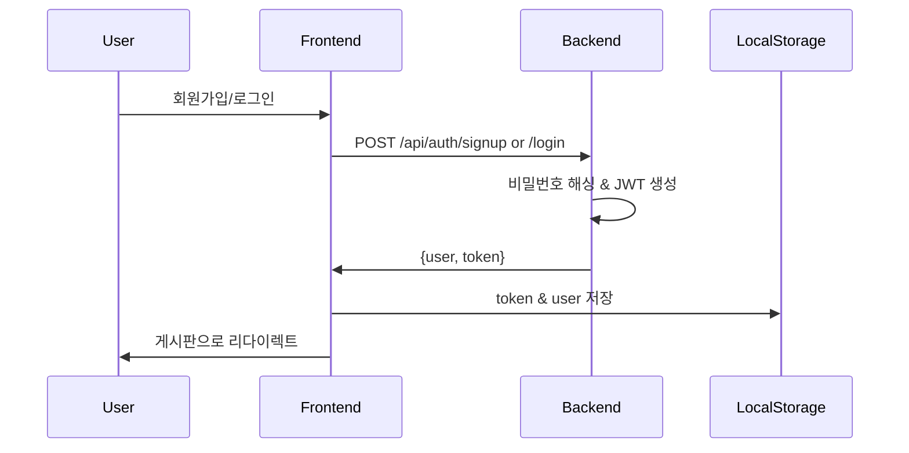

# 사용자 인증 및 게시판 시스템 with AI 피부 분석

Node.js와 Express를 사용한 JWT 기반 사용자 인증 시스템, 자유게시판, AI 피부 분석 서비스입니다. 회원가입, 로그인, 로그아웃, 회원탈퇴, 프로필 관리 기능과 게시글 작성, 조회, 수정, 삭제, 댓글, 좋아요 기능, 그리고 이미지 기반 AI 피부 분석 기능을 제공합니다.

## 기술 스택

### 백엔드
- **Node.js** - 서버 런타임
- **Express** - 웹 프레임워크
- **bcryptjs** - 비밀번호 해싱
- **jsonwebtoken** - JWT 토큰 생성 및 검증
- **express-validator** - 입력값 검증
- **express-rate-limit** - Rate limiting
- **multer** - 파일 업로드
- **dotenv** - 환경 변수 관리

### 프론트엔드
- **Vanilla JavaScript** - 순수 자바스크립트
- **HTML5/CSS3** - 마크업 및 스타일링
- **Fetch API** - 서버 통신

## 프로젝트 구조

```
.
├── backend/                 # 백엔드 서버
│   ├── src/                # 백엔드 소스 코드
│   │   ├── routes/         # API 라우트
│   │   │   ├── auth.js     # 인증 관련 엔드포인트
│   │   │   ├── board.js    # 게시판 관련 엔드포인트
│   │   │   └── ai.js       # AI 분석 관련 엔드포인트
│   │   ├── middleware/     # 미들웨어
│   │   │   ├── auth.js     # JWT 인증 미들웨어
│   │   │   └── rateLimiter.js # Rate Limiting 미들웨어
│   │   └── server.js       # 서버 진입점
│   ├── uploads/            # 업로드된 이미지 저장소
│   ├── .env                # 환경 변수 (git 제외)
│   ├── package.json        # 백엔드 의존성
│   └── node_modules/       # 백엔드 패키지
├── frontend/               # 프론트엔드 (정적 파일)
│   └── src/               # 프론트엔드 소스 코드
│       ├── index.html      # 로그인 페이지
│       ├── script.js       # 로그인 로직
│       ├── signup.html     # 회원가입 페이지
│       ├── signup.js       # 회원가입 로직
│       ├── board.html      # 게시판 메인 페이지
│       ├── board.js        # 게시판 로직
│       ├── post-detail.html# 게시글 상세 페이지
│       ├── post-detail.js  # 게시글 상세 로직
│       ├── post-write.html # 글쓰기/수정 페이지
│       ├── post-write.js   # 글쓰기/수정 로직
│       ├── profile.html    # 프로필 페이지
│       ├── profile.js      # 프로필 로직
│       ├── ai-analysis.html# AI 피부 분석 페이지
│       ├── ai-analysis.js  # AI 분석 로직
│       ├── ai-result.html  # AI 분석 결과 페이지
│       ├── ai-result.js    # AI 결과 로직
│       └── style.css       # 스타일시트
├── package.json            # 루트 패키지 설정
├── .gitignore             # Git 제외 파일
├── README.md              # 프로젝트 문서
└── CLAUDE.md              # Claude Code 가이드
```

## 빠른 시작

### 1. 의존성 설치

```bash
cd backend
npm install
```

### 2. 환경 변수 설정

`backend/.env` 파일을 생성하세요:

```bash
# backend/.env 파일 생성 (수동)
cat > backend/.env << EOF
JWT_SECRET=your-very-secure-random-string-here-minimum-32-characters
JWT_EXPIRE=24h
EOF
```

또는 텍스트 에디터로 `backend/.env` 파일을 만들어 다음 내용을 입력하세요:

```env
JWT_SECRET=your-very-secure-random-string-here-minimum-32-characters
JWT_EXPIRE=24h
```

> **보안 경고**: `JWT_SECRET`을 반드시 안전한 랜덤 문자열(최소 32자)로 변경하세요!

### 3. 서버 실행

프로젝트 루트에서:
```bash
npm start
```

또는 backend 디렉토리에서 직접:
```bash
cd backend
npm start
```

서버가 `http://localhost:3000`에서 실행됩니다.

## 실행 중인 서버 종료 후 재시작
포트 3000 사용 프로세스 강제 종료
lsof -ti:3000 | xargs kill -9

# 2. 서버 다시 시작
npm start


### 4. 브라우저에서 접속

| 페이지 | URL |
|--------|-----|
| 로그인 | http://localhost:3000/ |
| 회원가입 | http://localhost:3000/signup.html |
| 게시판 | http://localhost:3000/board.html |
| 프로필 | http://localhost:3000/profile.html |
| AI 피부 분석 | http://localhost:3000/ai-analysis.html |
| 게시글 작성 | http://localhost:3000/post-write.html |

## API 레퍼런스

### 인증 API (`/api/auth`)

| 메소드 | 엔드포인트 | 설명 | 요청 본문/파라미터 |
|--------|-----------|------|----------|
| POST | `/signup` | 회원가입 | `{email, password, name}` |
| POST | `/login` | 로그인 | `{email, password}` |
| POST | `/logout` | 로그아웃 | - |
| DELETE | `/delete` | 회원탈퇴 | `{email, password}` |
| GET | `/profile` | 프로필 조회 | `?userId=1` (쿼리 파라미터) |
| PUT | `/profile` | 프로필 수정 | `{userId, name?, currentPassword?, newPassword?}` |
| GET | `/my-posts` | 내가 쓴 글 | `?userId=1` (쿼리 파라미터) |
| GET | `/my-comments` | 내가 쓴 댓글 | `?userId=1` (쿼리 파라미터) |
| GET | `/users` | 사용자 목록 (개발용) | - |
| GET | `/test` | 연결 테스트 | - |

<details>
<summary>회원가입 예제</summary>

```bash
curl -X POST http://localhost:3000/api/auth/signup \
  -H "Content-Type: application/json" \
  -d '{
    "email": "user@example.com",
    "password": "password123",
    "name": "홍길동"
  }'
```

**응답**:
```json
{
  "success": true,
  "message": "회원가입이 완료되었습니다",
  "data": {
    "user": { "id": 1, "email": "user@example.com", "name": "홍길동" },
    "token": "eyJhbGciOiJIUzI1NiIsInR5cCI6IkpXVCJ9..."
  }
}
```
</details>

### 게시판 API (`/api/board/free`)

| 메소드 | 엔드포인트 | 설명 | 요청 본문 |
|--------|-----------|------|----------|
| GET | `/posts` | 게시글 목록 | - |
| POST | `/posts` | 게시글 작성 | `{title, content, authorId, authorName}` |
| GET | `/posts/:id` | 게시글 상세 | - |
| PUT | `/posts/:id` | 게시글 수정 | `{title, content, authorId}` |
| DELETE | `/posts/:id` | 게시글 삭제 | `{authorId}` |
| POST | `/posts/:id/like` | 좋아요 | `{userId}` |
| POST | `/posts/:id/comments` | 댓글 작성 | `{content, authorId, authorName}` |
| DELETE | `/posts/:postId/comments/:commentId` | 댓글 삭제 | `{authorId}` |

<details>
<summary>게시글 작성 예제</summary>

```bash
curl -X POST http://localhost:3000/api/board/free/posts \
  -H "Content-Type: application/json" \
  -d '{
    "title": "첫 번째 게시글",
    "content": "안녕하세요!",
    "authorId": 1,
    "authorName": "홍길동"
  }'
```
</details>

**모든 API 응답 형식**: `{success: boolean, message: string, data?: object, errors?: array}`

### AI 분석 API (`/api/ai`)

| 메소드 | 엔드포인트 | 설명 | 요청 본문/파라미터 | 인증 |
|--------|-----------|------|----------|------|
| POST | `/image-upload` | 이미지 업로드 | `multipart/form-data (image)` | 필수 |
| POST | `/survey` | 설문지 제출 | `{imageFilename, answers}` | 필수 |
| GET | `/survey/questions` | 설문지 질문 목록 | - | 불필요 |
| POST | `/survey/questions` | 설문지 질문 추가 (관리자) | `{question, type, options, required}` | 필수 |
| PUT | `/survey/questions/:id` | 설문지 질문 수정 (관리자) | `{question?, type?, options?, required?}` | 필수 |
| DELETE | `/survey/questions/:id` | 설문지 질문 삭제 (관리자) | - | 필수 |
| GET | `/analysis/:id` | 분석 결과 조회 | - | 필수 |
| GET | `/my-analyses` | 내 분석 결과 목록 | - | 필수 |

<details>
<summary>AI 분석 flow 예제</summary>

1. 이미지 업로드
```bash
curl -X POST http://localhost:3000/api/ai/image-upload \
  -H "Authorization: Bearer YOUR_TOKEN" \
  -F "image=@face.jpg"
```

2. 설문지 제출 및 분석
```bash
curl -X POST http://localhost:3000/api/ai/survey \
  -H "Authorization: Bearer YOUR_TOKEN" \
  -H "Content-Type: application/json" \
  -d '{
    "imageFilename": "skin-1234567890.jpg",
    "answers": ["건성", ["여드름", "모공"], "6-8시간", "1L-2L", "토너, 로션"]
  }'
```

3. 분석 결과 조회
```bash
curl http://localhost:3000/api/ai/analysis/1 \
  -H "Authorization: Bearer YOUR_TOKEN"
```
</details>

## 주요 기능

### 인증 시스템

#### 회원가입
- 이메일 형식 검증
- 비밀번호 최소 6자 이상
- 이름 필수 입력
- 중복 이메일 체크
- 비밀번호 bcrypt 해싱 (10 salt rounds)
- 회원가입 성공 시 JWT 토큰 발급

#### 로그인
- 이메일과 비밀번호 검증
- 비밀번호 해시 비교
- 로그인 성공 시 JWT 토큰 발급
- 토큰과 사용자 정보를 localStorage에 저장
- 자동으로 게시판 페이지로 리다이렉트

#### 로그아웃
- localStorage에서 토큰 및 사용자 정보 삭제
- JWT는 stateless이므로 서버에서 별도 처리 불필요

#### 회원탈퇴
- 이메일과 비밀번호 재확인
- 사용자 데이터 영구 삭제
- 삭제 전 확인 메시지 표시

#### 프로필 관리
- 프로필 정보 조회 (이메일, 이름, 가입일)
- 이름 변경
- 비밀번호 변경 (현재 비밀번호 확인 필요)
- 내가 쓴 게시글 목록 조회
- 내가 쓴 댓글 목록 조회
- 프로필 페이지에서 회원 탈퇴 가능

### 게시판 시스템

#### 게시글 관리
- 게시글 목록 조회 (최신순 정렬)
- 게시글 작성 (제목, 내용 필수)
- 게시글 상세 조회 (조회수 자동 증가)
- 게시글 수정 (작성자만 가능)
- 게시글 삭제 (작성자만 가능)
- 각 게시글에 댓글 수, 좋아요 수 표시

#### 좋아요
- 게시글에 좋아요 추가
- 사용자당 1회만 좋아요 가능
- 좋아요 수 실시간 표시

#### 댓글
- 댓글 작성 (로그인 사용자)
- 댓글 삭제 (작성자만 가능)
- 댓글 수 실시간 표시

### AI 피부 분석 시스템

#### 이미지 업로드
- 얼굴 사진 업로드 (JPG, PNG, 최대 5MB)
- 드래그 앤 드롭 지원
- 이미지 미리보기 기능

#### 설문 조사
- 동적 설문지 시스템 (질문 추가/수정/삭제 가능)
- 피부 타입, 생활 습관, 스킨케어 루틴 등
- 라디오, 체크박스, 텍스트 입력 지원

#### AI 분석
- 이미지 + 설문 데이터 기반 분석
- 피부 상태 종합 점수 (100점 만점)
- 수분, 탄력, 모공, 색소침착 상세 분석
- 맞춤형 추천 사항 제공

#### 분석 결과 관리
- 분석 결과 저장 및 조회
- 내 분석 기록 조회
- 시각적 결과 표시 (차트, 점수)

### 보안 기능

#### 구현됨
- JWT 인증 미들웨어
- 모든 Board API 및 AI API 인증 적용
- Rate Limiting (API 남용 방지)
  - 일반 API: 분당 100회
  - 인증 API: 15분당 5회
  - 게시글 작성: 분당 3회
- 비밀번호 bcrypt 해싱 (10 salt rounds)
- 입력값 검증 (express-validator)
- 중복 이메일 체크
- 에러 메시지 일반화 (로그인 실패 시)

#### 미구현 (향후 개선 필요)
- CORS 설정
- HTTPS 지원
- 파일 업로드 악성코드 검사

## 시스템 동작 방식

### 인증 흐름


### 게시판 동작
1. 게시글 목록은 최신순 정렬
2. 게시글 조회 시 조회수 자동 증가
3. 작성자 확인은 `authorId` 비교로 수행 (⚠️ JWT 검증 미구현)
4. 좋아요는 사용자당 1회 제한 (Set 자료구조 사용)
5. 게시글 삭제 시 댓글/좋아요도 함께 삭제

### 보안 기능

**구현됨**:
- 비밀번호 bcrypt 해싱 (10 salt rounds)
- JWT 토큰 발급
- 입력값 검증 (express-validator)
- 중복 이메일 체크
- 에러 메시지 일반화 (로그인 실패 시)

⚠️ **미구현** (보안 취약):
- JWT 토큰 검증 미들웨어
- API 엔드포인트 인증 체크
- Rate limiting
- CORS 설정

## 알려진 제한사항

>**이 프로젝트는 학습/프로토타입 목적입니다. 프로덕션 환경에 배포하지 마세요.**

### 중요한 제한사항

1. **인메모리 데이터 저장**
   - 모든 데이터(사용자, 게시글, 댓글, 좋아요)가 메모리에 저장됨
   - 서버 재시작 시 모든 데이터 손실
   - 데이터베이스 미사용

2. **인증/인가 미구현**
   - JWT 검증 미들웨어 없음
   - 게시판 API가 인증 없이 접근 가능
   - `authorId`를 요청 본문으로 받아 쉽게 위조 가능

3. **성능 이슈**
   - 페이지네이션 없음 (모든 게시글 한번에 로드)
   - 검색 기능 없음
   - 인덱싱 없음

4. **기타 제한사항**
   - 파일/이미지 업로드 불가
   - Rate limiting 없음
   - CORS 미설정
   - HTTPS 미지원
   - 에러 핸들링 기본 수준

### 개선 로드맵

**Phase 1: 보안 강화** (완료)
- [x] JWT 인증 미들웨어 구현
- [x] 모든 Board API에 인증 적용
- [x] Rate limiting 추가

**Phase 2: 데이터베이스 연동**
- [ ] MongoDB/PostgreSQL 연동
- [ ] 데이터 영속성 확보
- [ ] 인덱싱 추가

**Phase 3: 기능 확장** (일부 완료)
- [x] 게시글 검색
- [x] 이미지 업로드 (AI 분석용)
- [x] AI 피부 분석 시스템
- [ ] 게시글 페이지네이션
- [ ] 게시판 카테고리 분류
- [ ] 비밀번호 재설정
- [ ] 이메일 인증
- [ ] 실제 AI 모델 통합 (현재는 규칙 기반)

**Phase 4: 프로덕션 준비**
- [ ] HTTPS & CORS 설정
- [ ] 로깅 & 모니터링
- [ ] 배포 자동화

## 개발 가이드

### 디버깅 팁

**서버 측**:
```bash
# 서버 로그 확인 (콘솔 출력)
npm start

# 특정 에러 확인
# 회원가입 에러: "회원가입 에러:" 로 시작
# 로그인 에러: "로그인 에러:" 로 시작
```

**클라이언트 측**:
- Chrome DevTools → Network 탭: API 요청/응답 확인
- Chrome DevTools → Application → Local Storage: 토큰 & 사용자 정보 확인
- Chrome DevTools → Console: 클라이언트 에러 확인

### 빠른 테스트

```bash
# 서버 연결 테스트
curl http://localhost:3000/api/auth/test

# 모든 사용자 조회
curl http://localhost:3000/api/auth/users

# 모든 게시글 조회
curl http://localhost:3000/api/board/free/posts

# 회원가입 & 로그인 테스트
curl -X POST http://localhost:3000/api/auth/signup \
  -H "Content-Type: application/json" \
  -d '{"email":"test@test.com","password":"test123","name":"테스터"}'
```

### 프로젝트 구조 수정 시 주의사항

1. **폴더 이동 시**: `backend/src/server.js`의 static 파일 경로 확인
2. **환경변수 추가 시**: `.gitignore`에 민감 정보 제외 확인
3. **새 API 추가 시**: CLAUDE.md와 README.md 모두 업데이트

## 기여하기

1. Fork the Project
2. Create your Feature Branch (`git checkout -b feature/AmazingFeature`)
3. Commit your Changes (`git commit -m 'Add some AmazingFeature'`)
4. Push to the Branch (`git push origin feature/AmazingFeature`)
5. Open a Pull Request

## 라이선스

ISC License - 자유롭게 사용, 수정, 배포 가능합니다.

## 문의 및 지원

프로젝트 관련 문의사항이나 버그 리포트는 [GitHub Issues](../../issues)에 등록해주세요.
