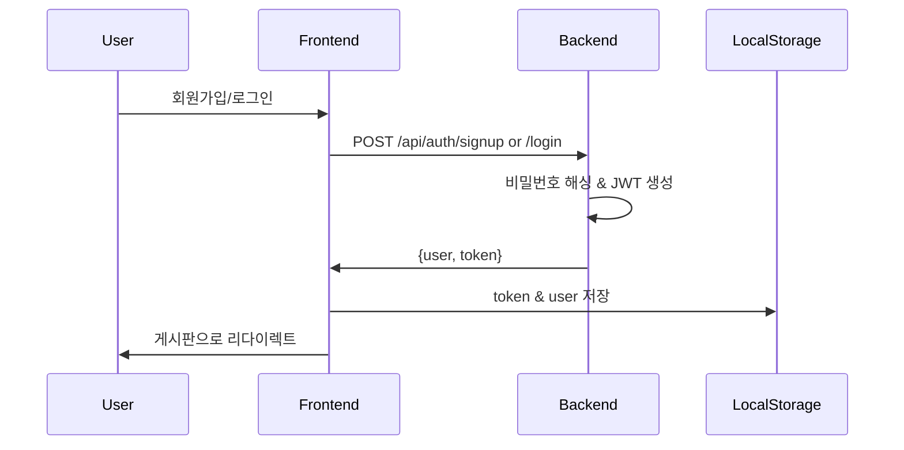
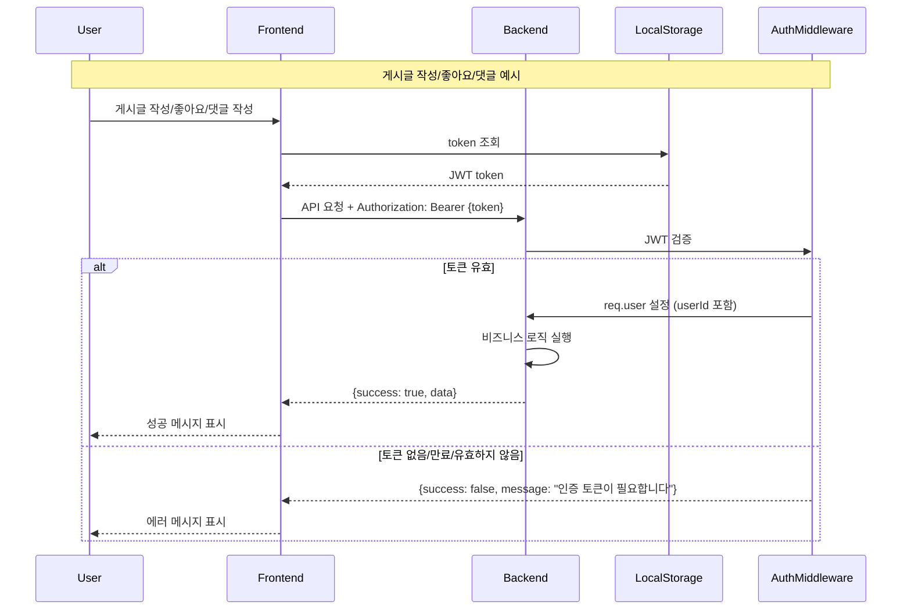

# SkinAI - 피부 건강 관리 플랫폼

Node.js와 Express를 사용한 JWT 기반 사용자 인증 시스템, 커뮤니티 게시판, AI 피부 분석 서비스입니다.

현대적인 UI/UX로 설계된 웹 애플리케이션으로, 회원가입/로그인, 프로필 관리, 카테고리별 게시판, 그리고 이미지 기반 AI 피부 분석 기능을 제공합니다.

## 기술 스택

### 백엔드
- **Node.js** - 서버 런타임
- **Express** - 웹 프레임워크
- **PostgreSQL** - 관계형 데이터베이스
- **pg** - PostgreSQL 클라이언트 라이브러리
- **bcryptjs** - 비밀번호 해싱
- **jsonwebtoken** - JWT 토큰 생성 및 검증
- **express-validator** - 입력값 검증
- **express-rate-limit** - Rate limiting
- **multer** - 파일 업로드
- **dotenv** - 환경 변수 관리
- **axios** - HTTP 클라이언트 (Flask AI 서비스 통신)

### AI 서비스 (Flask)
- **Python 3.8+** - AI 서비스 런타임
- **Flask** - 경량 웹 프레임워크
- **PyTorch 2.0+** - 딥러닝 프레임워크
- **torchvision** - 이미지 변환 및 모델
- **Pillow** - 이미지 처리
- **Gunicorn** - 프로덕션 WSGI 서버

### 프론트엔드
- **Vanilla JavaScript** - 순수 자바스크립트
- **HTML5/CSS3** - 마크업 및 스타일링
- **Fetch API** - 서버 통신

## 프로젝트 구조

```
.
├── backend/                 # 백엔드 서버
│   ├── src/                # 백엔드 소스 코드
│   │   ├── config/         # 설정 파일
│   │   │   ├── database.js # PostgreSQL 연결 설정
│   │   │   └── constants.js# 상수 정의
│   │   ├── models/         # 데이터 모델 (PostgreSQL 스키마)
│   │   │   ├── user.js     # 사용자 모델
│   │   │   ├── post.js     # 게시글 모델
│   │   │   ├── comment.js  # 댓글 모델
│   │   │   └── analysis.js # AI 분석 모델
│   │   ├── routes/         # API 라우트
│   │   │   ├── auth.js     # 인증 관련 엔드포인트
│   │   │   ├── board.js    # 게시판 관련 엔드포인트
│   │   │   └── ai.js       # AI 분석 관련 엔드포인트
│   │   ├── middleware/     # 미들웨어
│   │   │   ├── auth.js     # JWT 인증 미들웨어
│   │   │   └── rateLimiter.js # Rate Limiting 미들웨어
│   │   └── server.js       # 서버 진입점
│   ├── uploads/            # 업로드된 이미지 저장소
│   ├── .env                # 환경 변수 (git 제외)
│   ├── package.json        # 백엔드 의존성
│   └── node_modules/       # 백엔드 패키지
├── frontend/               # 프론트엔드 (정적 파일)
│   └── src/               # 프론트엔드 소스 코드
│       ├── index.html      # 랜딩 페이지
│       ├── script.js       # 랜딩 페이지 로직
│       ├── login.html      # 로그인 페이지
│       ├── signup.html     # 회원가입 페이지
│       ├── signup.js       # 회원가입 로직
│       ├── board.html      # 게시판 메인 페이지
│       ├── board.js        # 게시판 로직
│       ├── post-detail.html# 게시글 상세 페이지
│       ├── post-detail.js  # 게시글 상세 로직
│       ├── post-write.html # 글쓰기/수정 페이지
│       ├── post-write.js   # 글쓰기/수정 로직
│       ├── profile.html    # 프로필 페이지
│       ├── profile.js      # 프로필 로직
│       ├── ai-analysis.html# AI 피부 분석 페이지
│       ├── ai-analysis.js  # AI 분석 로직
│       ├── my-analyses.html# 내 AI 분석 기록 페이지
│       ├── ai-result.html  # AI 분석 결과 상세 페이지
│       ├── ai-result.js    # AI 결과 로직
│       ├── common-nav.js   # 공통 네비게이션 로직
│       └── style.css       # 전역 스타일시트
├── scin/                   # AI 모델 시스템
│   ├── api/                # Flask AI 서비스
│   │   ├── app.py          # Flask 서버 진입점
│   │   ├── config.py       # AI 서비스 설정
│   │   ├── inference.py    # 모델 추론 로직
│   │   └── uploads/        # AI 분석용 이미지 임시 저장
│   ├── model/              # 딥러닝 모델
│   │   ├── resnet50/       # ResNet50 모델
│   │   └── efficientnet_b3/# EfficientNet-B3 모델
│   ├── data/               # 데이터셋 및 전처리
│   ├── checkpoints/        # 학습된 모델 체크포인트
│   └── logs/               # 학습 로그
├── package.json            # 루트 패키지 설정
├── .gitignore             # Git 제외 파일
├── README.md              # 프로젝트 문서
├── Architecture.md        # 시스템 아키텍처 문서
└── CLAUDE.md              # Claude Code 가이드
```

## 빠른 시작

### 1. 의존성 설치

```bash
cd backend
npm install
```

### 2. PostgreSQL 데이터베이스 설정

PostgreSQL 설치 및 데이터베이스 생성:

```bash
# macOS (Homebrew)
brew install postgresql
brew services start postgresql

# 데이터베이스 생성
createdb skinai_db

# 또는 psql로 접속하여 생성
psql postgres
CREATE DATABASE skinai_db;
\q
```

### 3. 환경 변수 설정

`backend/.env` 파일을 생성하세요:

```bash
# backend/.env 파일 생성 (수동)
cat > backend/.env << EOF
# JWT 설정
JWT_SECRET=your-very-secure-random-string-here-minimum-32-characters
JWT_EXPIRE=24h

# PostgreSQL 데이터베이스 설정
DB_HOST=localhost
DB_PORT=5432
DB_NAME=skinai_db
DB_USER=your_db_username
DB_PASSWORD=your_db_password

# Flask AI 서비스 설정
FLASK_AI_SERVICE_URL=http://localhost:5000
FLASK_API_TIMEOUT=30000
EOF
```

또는 텍스트 에디터로 `backend/.env` 파일을 만들어 다음 내용을 입력하세요:

```env
# JWT 설정
JWT_SECRET=your-very-secure-random-string-here-minimum-32-characters
JWT_EXPIRE=24h

# PostgreSQL 데이터베이스 설정
DB_HOST=localhost
DB_PORT=5432
DB_NAME=skinai_db
DB_USER=your_db_username
DB_PASSWORD=your_db_password

# Flask AI 서비스 설정
FLASK_AI_SERVICE_URL=http://localhost:5000
FLASK_API_TIMEOUT=30000
```

> **보안 경고**:
> - `JWT_SECRET`을 반드시 안전한 랜덤 문자열(최소 32자)로 변경하세요!
> - `DB_USER`와 `DB_PASSWORD`를 실제 PostgreSQL 계정 정보로 변경하세요!

### 4. 서버 실행

프로젝트 루트에서:
```bash
npm start
```

또는 backend 디렉토리에서 직접:
```bash
cd backend
npm start
```

서버가 `http://localhost:3000`에서 실행됩니다.

## 실행 중인 서버 종료 후 재시작
```bash
# 1. 포트 3000 사용 프로세스 강제 종료
lsof -ti:3000 | xargs kill -9

# 2. 서버 다시 시작
npm start
```

### 5. 브라우저에서 접속

| 페이지 | URL | 설명 |
|--------|-----|------|
| 랜딩 페이지 (홈) | http://localhost:3000/ | 서비스 소개 및 시작 |
| 로그인 | http://localhost:3000/login.html | 사용자 로그인 |
| 회원가입 | http://localhost:3000/signup.html | 신규 회원가입 |
| AI 피부 분석 | http://localhost:3000/ai-analysis.html | 이미지 업로드 및 설문 |
| 내 분석 결과 | http://localhost:3000/my-analyses.html | AI 분석 기록 목록 |
| AI 분석 결과 상세 | http://localhost:3000/ai-result.html?id=1 | 분석 결과 상세 보기 |
| 게시판 (커뮤니티) | http://localhost:3000/board.html | 커뮤니티 게시판 |
| 게시글 작성 | http://localhost:3000/post-write.html | 새 게시글 작성 |
| 게시글 상세 | http://localhost:3000/post-detail.html?id=1 | 게시글 상세 및 댓글 |
| 프로필 | http://localhost:3000/profile.html | 사용자 프로필 관리 |

## API 레퍼런스

### 인증 API (`/api/auth`)

| 메소드 | 엔드포인트 | 설명 | 요청 본문/파라미터 |
|--------|-----------|------|----------|
| POST | `/signup` | 회원가입 | `{email, password, name}` |
| POST | `/login` | 로그인 | `{email, password}` |
| POST | `/logout` | 로그아웃 | - |
| DELETE | `/delete` | 회원탈퇴 | `{email, password}` |
| GET | `/profile` | 프로필 조회 | `?userId=1` (쿼리 파라미터) |
| PUT | `/profile` | 프로필 수정 | `{userId, name?, currentPassword?, newPassword?}` |
| GET | `/my-posts` | 내가 쓴 글 | `?userId=1` (쿼리 파라미터) |
| GET | `/my-comments` | 내가 쓴 댓글 | `?userId=1` (쿼리 파라미터) |
| GET | `/users` | 사용자 목록 (개발용) | - |
| GET | `/test` | 연결 테스트 | - |

<details>
<summary>회원가입 예제</summary>

```bash
curl -X POST http://localhost:3000/api/auth/signup \
  -H "Content-Type: application/json" \
  -d '{
    "email": "user@example.com",
    "password": "password123",
    "name": "홍길동"
  }'
```

**응답**:
```json
{
  "success": true,
  "message": "회원가입이 완료되었습니다",
  "data": {
    "user": { "id": 1, "email": "user@example.com", "name": "홍길동" },
    "token": "eyJhbGciOiJIUzI1NiIsInR5cCI6IkpXVCJ9..."
  }
}
```
</details>

### 게시판 API (`/api/board/free`)

| 메소드 | 엔드포인트 | 설명 | 요청 본문 | 인증 |
|--------|-----------|------|----------|------|
| GET | `/posts` | 게시글 목록 | `?search=검색어` (선택) | 필수 |
| POST | `/posts` | 게시글 작성 | `{category, title, content, authorId, authorName}` | 필수 |
| GET | `/posts/:id` | 게시글 상세 | - | 필수 |
| PUT | `/posts/:id` | 게시글 수정 | `{category?, title, content, authorId}` | 필수 |
| DELETE | `/posts/:id` | 게시글 삭제 | `{authorId}` | 필수 |
| POST | `/posts/:id/like` | 좋아요 | `{userId}` | 필수 |
| POST | `/posts/:id/comments` | 댓글 작성 | `{content, authorId, authorName}` | 필수 |
| DELETE | `/posts/:postId/comments/:commentId` | 댓글 삭제 | `{authorId}` | 필수 |

**카테고리**: `free` (자유게시판), `question` (질문), `info` (정보공유)

<details>
<summary>게시글 작성 예제</summary>

```bash
curl -X POST http://localhost:3000/api/board/free/posts \
  -H "Content-Type: application/json" \
  -H "Authorization: Bearer YOUR_JWT_TOKEN" \
  -d '{
    "category": "free",
    "title": "첫 번째 게시글",
    "content": "안녕하세요!",
    "authorId": 1,
    "authorName": "홍길동"
  }'
```
</details>

**모든 API 응답 형식**: `{success: boolean, message: string, data?: object, errors?: array}`

### AI 분석 API (`/api/ai`)

| 메소드 | 엔드포인트 | 설명 | 요청 본문/파라미터 | 인증 |
|--------|-----------|------|----------|------|
| POST | `/image-upload` | 이미지 업로드 | `multipart/form-data (image)` | 필수 |
| POST | `/survey` | 설문지 제출 | `{imageFilename, answers}` | 필수 |
| GET | `/survey/questions` | 설문지 질문 목록 | - | 불필요 |
| POST | `/survey/questions` | 설문지 질문 추가 (관리자) | `{question, type, options, required}` | 필수 |
| PUT | `/survey/questions/:id` | 설문지 질문 수정 (관리자) | `{question?, type?, options?, required?}` | 필수 |
| DELETE | `/survey/questions/:id` | 설문지 질문 삭제 (관리자) | - | 필수 |
| GET | `/analysis/:id` | 분석 결과 조회 | - | 필수 |
| GET | `/my-analyses` | 내 분석 결과 목록 | - | 필수 |

<details>
<summary>AI 분석 flow 예제</summary>

1. 이미지 업로드
```bash
curl -X POST http://localhost:3000/api/ai/image-upload \
  -H "Authorization: Bearer YOUR_TOKEN" \
  -F "image=@face.jpg"
```

2. 설문지 제출 및 분석
```bash
curl -X POST http://localhost:3000/api/ai/survey \
  -H "Authorization: Bearer YOUR_TOKEN" \
  -H "Content-Type: application/json" \
  -d '{
    "imageFilename": "skin-1234567890.jpg",
    "answers": ["건성", ["여드름", "모공"], "6-8시간", "1L-2L", "토너, 로션"]
  }'
```

3. 분석 결과 조회
```bash
curl http://localhost:3000/api/ai/analysis/1 \
  -H "Authorization: Bearer YOUR_TOKEN"
```
</details>

## 주요 기능

### 🎨 현대적인 UI/UX
- **랜딩 페이지**: Hero 섹션과 서비스 소개
- **통합 네비게이션**: 모든 페이지에서 일관된 네비게이션 바
- **반응형 디자인**: 모바일, 태블릿, 데스크톱 지원
- **로그인 상태 관리**: 로그인 시 회원가입 메뉴 자동 숨김
- **직관적인 인터페이스**: 카드 기반 레이아웃, 부드러운 애니메이션

### 인증 시스템

#### 회원가입
- 이메일 형식 검증
- 비밀번호 최소 6자 이상
- 비밀번호 확인 필드
- 이름 필수 입력
- 중복 이메일 체크
- 비밀번호 bcrypt 해싱 (10 salt rounds)
- 회원가입 성공 시 JWT 토큰 발급
- 혜택 안내 사이드바

#### 로그인
- 이메일과 비밀번호 검증
- 비밀번호 해시 비교
- 로그인 성공 시 JWT 토큰 발급
- 토큰과 사용자 정보를 localStorage에 저장
- 자동으로 게시판 페이지로 리다이렉트

#### 로그아웃
- localStorage에서 토큰 및 사용자 정보 삭제
- 프로필 페이지 헤더에 로그아웃 버튼
- JWT는 stateless이므로 서버에서 별도 처리 불필요

#### 회원탈퇴
- 이메일과 비밀번호 재확인
- 사용자 데이터 영구 삭제
- 삭제 전 확인 메시지 표시

#### 프로필 관리
- **현대적인 프로필 페이지**: 그라디언트 헤더, 탭 네비게이션
- **4개 탭 시스템**:
  - 내 정보: 이름, 이메일, 비밀번호 변경
  - AI 분석 기록: 과거 피부 분석 결과 조회
  - 작성한 게시글: 카테고리 배지와 함께 표시
  - 작성한 댓글: 해당 게시글로 이동 가능
- 아바타 표시 (이름 첫 글자)
- 프로필 페이지에서 회원 탈퇴 및 로그아웃 가능

### 게시판 시스템 (커뮤니티)

#### 카테고리 시스템
- **3개 카테고리**: 자유게시판, 질문, 정보공유
- 카테고리별 필터링
- 게시글 작성 시 카테고리 선택 필수
- 카테고리별 게시글 수 표시

#### 게시글 관리
- 게시글 목록 조회 (최신순 정렬)
- 게시글 작성 (카테고리, 제목, 내용 필수)
- 게시글 상세 조회 (조회수 자동 증가)
- 게시글 수정 (작성자만 가능)
- 게시글 삭제 (작성자만 가능)
- 각 게시글에 카테고리 배지, 댓글 수, 좋아요 수 표시
- 검색 기능 (제목, 내용, 작성자명)

#### 좋아요
- 게시글에 좋아요 추가
- 사용자당 1회만 좋아요 가능
- 좋아요 수 실시간 표시

#### 댓글
- 댓글 작성 (로그인 사용자)
- 댓글 삭제 (작성자만 가능)
- 댓글 수 실시간 표시

### AI 피부 분석 시스템

#### 이미지 업로드
- 얼굴 사진 업로드 (JPG, PNG, 최대 5MB)
- 드래그 앤 드롭 지원
- 이미지 미리보기 기능

#### 설문 조사
- 동적 설문지 시스템 (질문 추가/수정/삭제 가능)
- 피부 타입, 생활 습관, 스킨케어 루틴 등
- 라디오, 체크박스, 텍스트 입력 지원

#### AI 분석
- 이미지 + 설문 데이터 기반 분석
- 피부 상태 종합 점수 (100점 만점)
- 수분, 탄력, 모공, 색소침착 상세 분석
- 맞춤형 추천 사항 제공

#### 분석 결과 관리
- 분석 결과 저장 및 조회
- 내 분석 기록 조회
- 시각적 결과 표시 (차트, 점수)

### 🔒 보안 기능

#### 구현됨 ✅
- **JWT 인증**: 모든 Board API 및 AI API에 인증 적용
- **JWT 인증 미들웨어**: `backend/src/middleware/auth.js`
- **Rate Limiting** (API 남용 방지):
  - 일반 API: 분당 100회
  - 인증 API (login/signup): 15분당 5회
  - 게시글 작성: 분당 3회
- **비밀번호 보안**: bcrypt 해싱 (10 salt rounds)
- **입력값 검증**: express-validator를 통한 모든 입력값 검증
- **중복 이메일 체크**: 회원가입 시 자동 확인
- **에러 메시지 일반화**: 로그인 실패 시 구체적 정보 노출 방지
- **파일 업로드 제한**:
  - 최대 파일 크기: 5MB
  - 허용 형식: JPG, PNG만

#### 미구현 ⚠️ (향후 개선 필요)
- CORS 설정
- HTTPS 지원
- 파일 업로드 악성코드 검사
- 세션 관리
- 비밀번호 재설정
- 이메일 인증

## 시스템 동작 방식

### 인증 흐름


### 인증이 필요한 API 호출 흐름


### 게시판 동작
1. 게시글 목록은 최신순 정렬 (PostgreSQL ORDER BY)
2. 게시글 조회 시 조회수 자동 증가 (PostgreSQL UPDATE)
3. 작성자 확인은 JWT에서 추출한 `userId`로 수행 (✅ 구현됨)
4. 좋아요는 사용자당 1회 제한 (post_likes 테이블의 UNIQUE 제약조건)
5. 게시글 삭제 시 댓글/좋아요도 함께 삭제 (PostgreSQL CASCADE)

### 보안 기능

**구현됨**:
- 비밀번호 bcrypt 해싱 (10 salt rounds)
- JWT 토큰 발급 및 검증
- JWT 인증 미들웨어 (`backend/src/middleware/auth.js`)
- 모든 Board API 및 AI API 인증 적용
- Rate Limiting (API 남용 방지)
  - 일반 API: 분당 100회
  - 인증 API (login/signup): 15분당 5회
  - 게시글 작성: 분당 3회
- 입력값 검증 (express-validator)
- 중복 이메일 체크
- 에러 메시지 일반화 (로그인 실패 시)

⚠️ **미구현** (향후 개선 필요):
- CORS 설정
- HTTPS 지원
- 파일 업로드 악성코드 검사

## 알려진 제한사항

>**이 프로젝트는 학습/프로토타입 목적입니다. 프로덕션 환경에 배포하지 마세요.**

### 중요한 제한사항

1. **성능 이슈**
   - 페이지네이션 없음 (모든 게시글 한번에 로드)
   - 이미지 파일 로컬 저장 (클라우드 스토리지 미사용)
   - 데이터베이스 인덱스 최적화 필요

2. **AI 분석 제한**
   - Flask AI 서비스와 HTTP 통신 지연 가능
   - 이미지 파일 크기 제한 (최대 5MB)
   - 실시간 분석 속도 개선 필요

3. **기타 제한사항**
   - CORS 미설정
   - HTTPS 미지원
   - 에러 핸들링 기본 수준
   - 파일 업로드 악성코드 검사 미구현

### 개선 로드맵

**Phase 1: 보안 강화** ✅ 완료
- [x] JWT 인증 미들웨어 구현
- [x] 모든 Board API 및 AI API에 인증 적용
- [x] Rate limiting 추가

**Phase 2: UI/UX 개선** ✅ 완료
- [x] 현대적인 랜딩 페이지
- [x] 통합 네비게이션 시스템
- [x] 프로필 페이지 탭 시스템
- [x] 게시판 카테고리 시스템 (자유게시판, 질문, 정보공유)
- [x] 반응형 디자인
- [x] 카드 기반 레이아웃

**Phase 3: AI 모델 통합** ✅ 완료
- [x] 이미지 업로드 (AI 분석용)
- [x] AI 피부 분석 시스템
- [x] Flask AI 서비스 마이크로서비스 아키텍처
- [x] PyTorch 기반 ResNet50/EfficientNet-B3 모델 통합
- [x] 50가지 피부 질환 분류 시스템

**Phase 4: 데이터베이스 연동** 🚧 진행 중
- [x] PostgreSQL 연동
- [x] 데이터 영속성 확보
- [ ] 데이터베이스 스키마 마이그레이션
- [ ] 인덱싱 추가 및 쿼리 최적화
- [ ] 클라우드 이미지 스토리지 (AWS S3, Cloudinary 등)

**Phase 5: 기능 확장**
- [x] 게시글 검색
- [x] 게시판 카테고리 분류
- [ ] 게시글 페이지네이션
- [ ] 비밀번호 재설정
- [ ] 이메일 인증
- [ ] 알림 시스템

**Phase 6: 프로덕션 준비**
- [ ] HTTPS & CORS 설정
- [ ] 로깅 & 모니터링 시스템
- [ ] 배포 자동화 (Docker, CI/CD)
- [ ] 성능 최적화 및 캐싱
- [ ] 부하 테스트

## 개발 가이드

### 디버깅 팁

**서버 측**:
```bash
# 서버 로그 확인 (콘솔 출력)
npm start

# 특정 에러 확인
# 회원가입 에러: "회원가입 에러:" 로 시작
# 로그인 에러: "로그인 에러:" 로 시작
```

**클라이언트 측**:
- Chrome DevTools → Network 탭: API 요청/응답 확인
- Chrome DevTools → Application → Local Storage: 토큰 & 사용자 정보 확인
- Chrome DevTools → Console: 클라이언트 에러 확인

### 빠른 테스트

```bash
# 서버 연결 테스트
curl http://localhost:3000/api/auth/test

# 모든 사용자 조회
curl http://localhost:3000/api/auth/users

# 모든 게시글 조회
curl http://localhost:3000/api/board/free/posts

# 회원가입 & 로그인 테스트
curl -X POST http://localhost:3000/api/auth/signup \
  -H "Content-Type: application/json" \
  -d '{"email":"test@test.com","password":"test123","name":"테스터"}'
```

### 프로젝트 구조 수정 시 주의사항

1. **폴더 이동 시**: `backend/src/server.js`의 static 파일 경로 확인
2. **환경변수 추가 시**: `.gitignore`에 민감 정보 제외 확인
3. **새 API 추가 시**: CLAUDE.md와 README.md 모두 업데이트

## 기여하기

1. Fork the Project
2. Create your Feature Branch (`git checkout -b feature/AmazingFeature`)
3. Commit your Changes (`git commit -m 'Add some AmazingFeature'`)
4. Push to the Branch (`git push origin feature/AmazingFeature`)
5. Open a Pull Request

## 변경 로그

### v2.0.2 (2025-10-28) - 홈페이지 및 기능 소개 개선
- 🎨 홈페이지 기능 카드 간소화 (5개 → 3개)
- ➖ 제거된 기능: 전문의 상담 이력 관리, 개인화된 건강 리포트, 정기 알림 서비스
- ➕ 새로운 기능 추가: 커뮤니티 활성화 카드
- 🔄 회원가입 페이지 혜택 섹션 동일하게 업데이트
- 🎯 로그인 상태에 따른 동적 버튼 변경
  - 비로그인: "회원가입하고 시작하기" → 회원가입 페이지
  - 로그인: "커뮤니티 이동" → 커뮤니티 페이지
- 🎨 전체적으로 커뮤니티 중심 메시지로 일관성 강화

### v2.0.1 (2025-10-27) - 네비게이션 개선
- 🔧 '결과보기' 메뉴를 AI 분석 기록 페이지로 변경
- ➕ 내 AI 분석 기록 페이지 추가 (my-analyses.html)
- 👤 사용자 아이콘 클릭 시 프로필 페이지로 이동
- 🔑 로그아웃 시 메시지 제거 (즉시 리다이렉트)
- 🐛 프로필 페이지 데이터 로딩 오류 수정

### v2.0.0 (2025-10-27) - UI/UX 대규모 개선
- 🎨 현대적인 랜딩 페이지 추가 (Hero 섹션, 서비스 소개)
- 🎨 로그인 페이지 분리 (index.html → login.html)
- 🎨 회원가입 페이지 개선 (비밀번호 확인, 혜택 안내 사이드바)
- 🎨 프로필 페이지 완전 재설계 (그라디언트 헤더, 탭 네비게이션, 4개 탭)
- 📁 게시판 카테고리 시스템 (자유게시판, 질문, 정보공유)
- 🔧 통합 네비게이션 시스템 (common-nav.js)
- 🔐 로그인 상태별 메뉴 표시/숨김 기능
- 🔑 프로필 페이지에 로그아웃 버튼 추가
- 📱 반응형 디자인 개선
- 🎯 카드 기반 레이아웃 적용

### v1.0.0 (이전) - 초기 버전
- ✅ JWT 기반 인증 시스템
- ✅ 게시판 CRUD 기능
- ✅ AI 피부 분석 시스템
- ✅ Rate Limiting
- ✅ 파일 업로드 (이미지)

---

